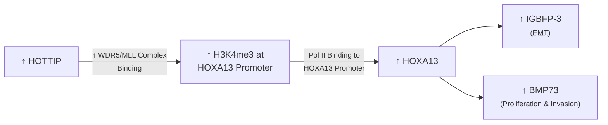
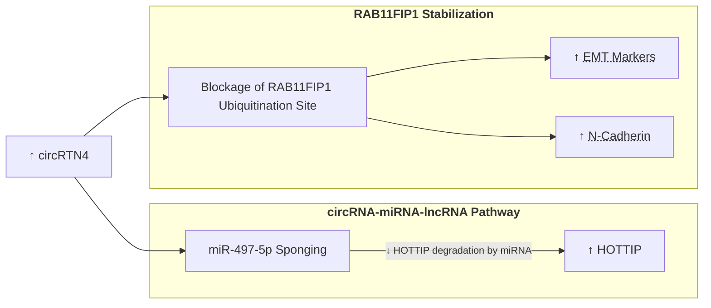

**Subtopics:**
- Types of ncRNAs in Cancer
- circRTN4

---
#### **Types of ncRNAs in Cancer**
- ncRNA accounts for 97% of genome transcribed into RNA
	- Can be oncogenes / tumor suppressors

| ncRNA   | Structural Characteristics                                          | Mechanism                                                                                                                                                                                                                                                                                                                  | Example                                                                                                                                          |
| ------- | ------------------------------------------------------------------- | -------------------------------------------------------------------------------------------------------------------------------------------------------------------------------------------------------------------------------------------------------------------------------------------------------------------------- | ------------------------------------------------------------------------------------------------------------------------------------------------ |
| miRNA   | < 22 bases                                                          | Bind to complementary mRNA as part of <abbr Title="RNA-Induced Silencing Complex">RISC</abbr> → mRNA degradation by RISC → Gene Downregulation **Analogy**: <abbr Title="RISC">Assassin</abbr> obtains <abbr Title="miRNA">address label</abbr> → Kill <abbr Title="complementary mRNA">people</abbr> at the address | miR-126: p53 Downregulation → ↓ Tumor Suppression                                                                    |
| piRNA   | 24-30 bases                                                         | Guides PIWI proteins to target <abbr Title="DNA Segments that can move within the genome">Transposons</abbr> → Form <abbr Title="piRNA-Induced Silencing Complex">piRISCs</abbr> to silence Transposons                                                                                                                 | piRNA-823: Deactivates <abbr Title="Apoptosis-Associated Transcription Factor">HSF1</abbr> → ↓ Cancer Cell Apoptosis |
| lncRNA  | > 200 bases; linear                                                 | Many (e.g. mRNA interaction & Histone modification) → Gene Downregulation                                                                                                                                                                                                                                               | <abbr Title="HOXA Transcript At Te Distal Tip">HOTTIP</abbr>                                                            |
| circRNA | > 200 bases; <abbr Title="3' end joins with 5' end">circular</abbr> | **miRNA Sponge**: Bind to complementary miRNA → Prevent mRNA degradation by miRNA                                                                                                                                                                                                                                       | circRTN4                                                                                                                |

**HOTTIP lncRNA in Pancreatic Carcinogenesis**

#### **circRTN4**
- Upregulated in <abbr Title="Pancreatic Ductal Adenocarcinoma">PDAC</abbr> and other cancers

**Formation of circRTN4**
- Back-splicing (Non-canonical Splicing) of Chr2 RTN4 Exon 4 & 5
	- Canonical Splicing: 3' end of Upstream Exon joins 5' end of Downstream Exon
	- Non-canonical Splicing: 3' end of Downstream Exon joins 5' end of Upstream Exon

**Mechanisms of circRTN4**

- Ubiquitin: Protein that facilitates protein degradation