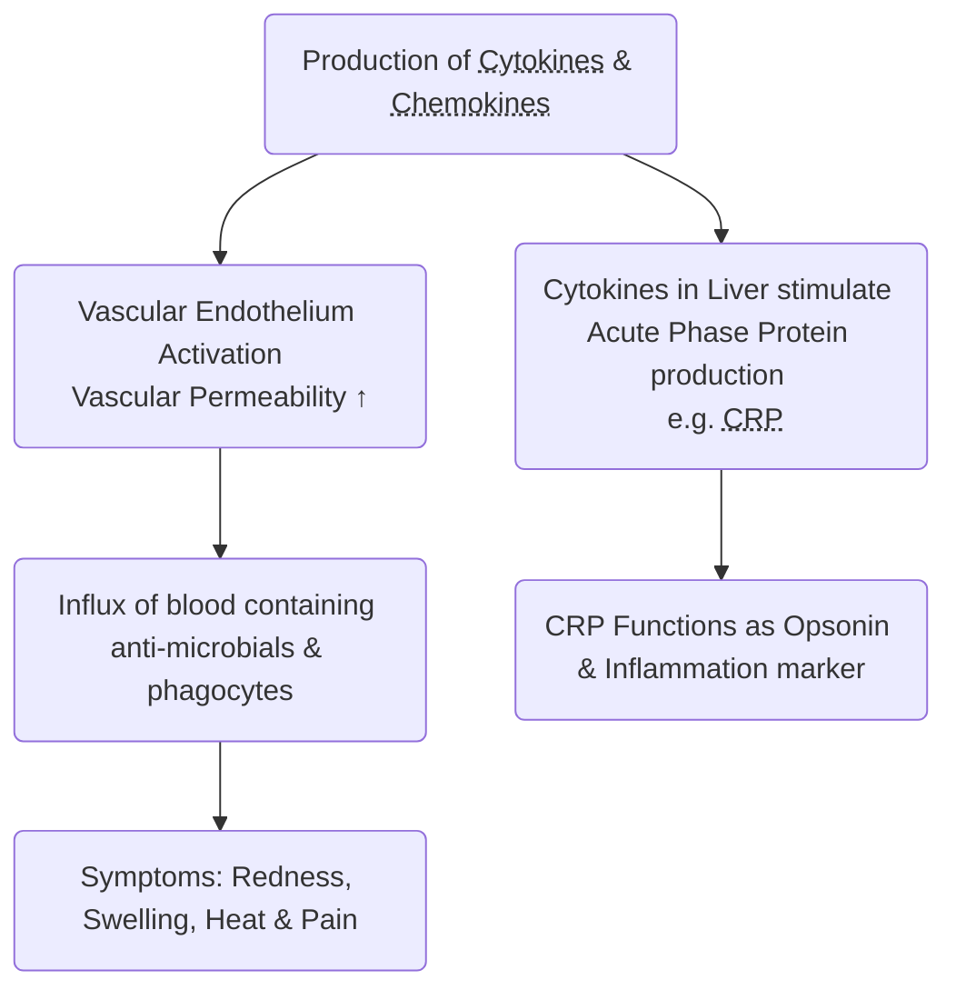
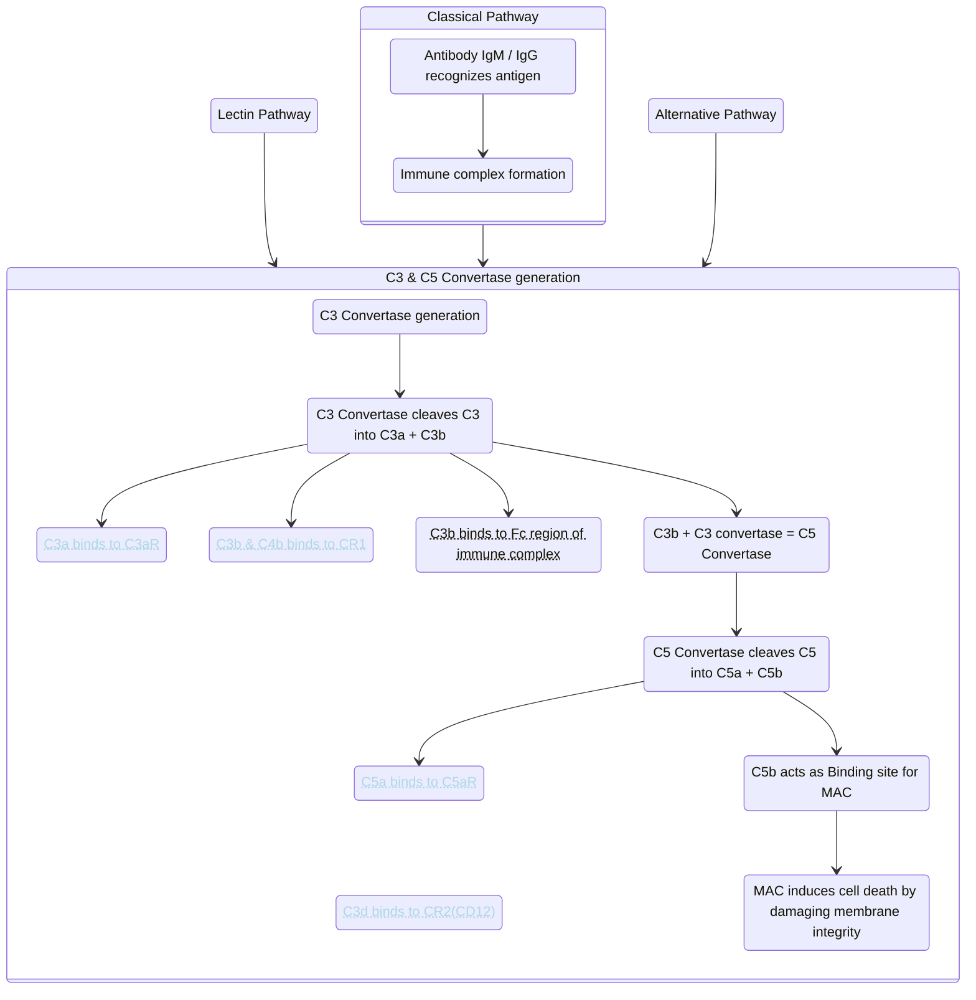

Lecture Notes

**Lecture Coverage:**
- Innate Immunity
- Complement System
- Bridging between Innate and Adaptive Immunity

---
#### **Innate Immunity**
**1st Line of Defense: Physical Barrier**
- Keratin on Skin
- Mucosal & Glandular Surface
	- Expel response in airway & lungs
		- Facilitated by cilia & mucus
	- Mucus in GI Tract

**1st Line of Defense: Chemical Barrier**
- Acidic pH & Digestive Enzymes in GI Tract
- Antimicrobial Peptides

| Antimicrobial Peptides | Location                              | Antimicrobial Activities                                                                              |
| ---------------------- | ------------------------------------- | ----------------------------------------------------------------------------------------------------- |
| Lysozyme               | Mucosal/Glandular Secretions          | Bacterial <abbr Title="Through cleavage of glycosidic bonds in peptidoglycans">Cell Wall Lysis</abbr> |
| Defensin α/β           | Skin & Mucosal Epithelia              | Disrupt membranes of pathogens                                                                        |
| Surfactant Proteins    | Respiratory Tract & Mucosal Epithelia | Block bacterial surface components Promotes Phagocytosis                                           |

**Receptors in the 2nd Line of Defense: PRRs**
- Major Type of PRR: <abbr Title="Toll-like Receptor Family">TLR</abbr>
	- Membrane-bound to Plasma membrane, Endosome & Lysosome
	- <abbr Title="Leucine-rich Repeats">LRR</abbr> as recognition regions
		- Plasma membrane: Outside membrane
		- Endosome & Lysosome: <abbr Title="Due to pathogens being ingested">Inside membrane</abbr>
	- TLR Ligands:

| TLR Ligands               | Pathogens Detected   |
| ------------------------- | -------------------- |
| Lipopolysaccharides       | Gram -ve pathogens   |
| Peptidoglycan             | Gram +ve pathogens   |
| Cell wall polysaccharides | Fungi                |
| Flagellins                | Flagellated bacteria |
| DNA & RNA                 | Virus & Bacteria     |
- TLR Signaling Pathway:

| Step  | Process                                                                                                                               |
| :---: | ------------------------------------------------------------------------------------------------------------------------------------- |
|   1   | Ligand-induced TLR Dimerization                                                                                                       |
|  2 | Cascade of Common & Unique signaling components - Common: NF-κB - Unique: <abbr Title="Interferon Regulatory Factor">IRF</abbr> |
|  3 | Transcription of Proteins - Cytokines, Chemokines & Antimicrobials - Not phagocytic receptors                                   |
- Other types of PRRs:

| PRR                                              | Ligands                             | Note                                    |
| ------------------------------------------------ | ----------------------------------- | --------------------------------------- |
| <abbr Title="C-Type Lectin Receptors">CLR</abbr> | Pathogen Carbohydrates Allergens | Phagocytic receptors on plasma membrane |
| <abbr Title="Nod-like Receptors">NLR</abbr>      | Cytosolic Pathogens                 | Part of NLR inflammasome                |
| <abbr Title="AIM-2 Like Receptors">ALR</abbr>    | Cytosolic DNA (dsDNA)               |  /                                   |
| <abbr Title="RIG-like Receptors">RLR</abbr>      | Cytosolic RNA (dsRNA)               | ^                                       |

**2nd Line of Defense: Local Inflammation**
- Caused by infection, tissue damage or harmful substance
- A cascade of innate response events by <abbr Title="Pattern Recognition Receptor">PRR</abbr> Signaling:

**2nd Line of Defense: Phagocytosis**

| Step  | Event                                                                                                                                         |
| ----- | --------------------------------------------------------------------------------------------------------------------------------------------- |
| 1     | PAMP/DAMP recognized by PRRs on Phagocytes, or Opsonin recognized by Opsonin receptors                                                     |
| 2     | Pseudopodium extends to ingest microbe                                                                                                        |
| 3     | Phagosome forms and fuses with lysosome                                                                                                       |
|  4 | Microbe is killed by: - Anti-microbial peptides - Low pH - <abbr Title="Reactive Oxygen/Nitrogen Species (ROS/RNS)">Oxidative Attack |

 

#### **Complement System**
- Immunoresponse enhancing host defenses through:

|                                                          Process                                                          |            <             | Molecules involved                                                                                                           | Receptors   |
| :-----------------------------------------------------------------------------------------------------------------------: | :----------------------: | ---------------------------------------------------------------------------------------------------------------------------- | ----------- |
|                                                        Cell Death                                                         |            <             | <abbr Title="Membrane Attack Complex">MAC</abbr>:C5b678 + Poly-C9                                                            | /           |
|                                                       Opsonization                                                        |            <             | Opsonin: C3b & C4b                                                                                                           | CR1         |
|                                                       Inflammation                                                        |            <             | <abbr Title="Chemoattractants to induce proinflammatory cytokine expression in other cells">Anaphylatoxins: C3a & C5a</abbr> | C3aR & C5aR |
|                                              Adaptive Immunity cross-talk                                              |   Antigen uptake by DC   |                                                                                                                              |             |
|                                                             ^                                                             | B-Cell mediated immunity | CD21 Ligand: C3d                                                                                                             | CR2 (CD21)  |
| <abbr Title="Immunoresponse termination & disposal of apoptotic bodies / immune complex">Immunoresponse Contraction Phase |            <             |                                                                                                                              |             |

**Complement System Pathway**
- 3 major pathways → C3 & C5 Convertase generation → Complement Receptor Activation

 

#### **Bridging between Innate and Adaptive Immunity**
- Involves <abbr Title="Dendritic Cells">DCs</abbr> at different states & APCs
	- Professional APCs: DCs, Macrophages & B-Cells
		- Requires Co-stimulatory molecules CD80/86 & MHCII to activate T-Cells

|   DC State   | Immunity System | Actions                                                                                                                                                                                                          |
| :----------: | :-------------: | ---------------------------------------------------------------------------------------------------------------------------------------------------------------------------------------------------------------- |
|   Immature   |     Innate      | Recognize PAMPs through PRRs -Activates phagocytosis & signaling pathway                                                                                                                                      |
|  Transition  |        <        | Carry bound microbes and travel to secondary lymphatic tissues -Internalizes foreign antigen & expresses it on MHCII                                                                                          |
| Mature (APC) |    Adaptive     | <abbr Title="Increased MHCII, CD80 & CD86 level">Matures & Becomes APC by PRR</abbr> signaling - Presents <abbr Title="Major Histocompatibility Complex">MHC</abbr>-Antigen complex to activate naïve T-cells |
- Activation of T-Cells are pathogen specific
	- TH cells
		- Different pathogen → different TLR responses → DC release different IL → Different TH types

| Pathogen          | TLR                    | IL by DC              | T-Cell                                          | Effects                                                                                               |
| ----------------- | ---------------------- | --------------------- | ----------------------------------------------- | ----------------------------------------------------------------------------------------------------- |
| Gram -ve bacteria | 4(5)                   |  IL-12             |  TH1     ㅤ                        |  IFNγ ↑ → <abbr Title="Macrophage M1, Viral specific Tc cells & B Cells">Cellular Responses</abbr> |
| Virus             | 3/7/9                  | ^                     | ^                                               | ^                                                                                                     |
| Gram +ve bacteria | 2/1                    |  IL-10 (IL-12↓) | TH2                                  | IL-4/5/13 ↑ → <abbr Title="Antibodies">Humoral Responses</abbr>                                       |
| Parasite          | 2/6                    | ^                     | T<abbr Title="regulatory">reg</abbr> | TGF-β1/IL10 ↑ → Cytokine/APC Inhibition                                                               |
| Fungi             | CLR/Dectin-1 (Not TLR) | TNF-α & IL-6/23       | TH17                                 | IL-17 ↑ → <abbr Title="Phagocytic Neutrophils">Cellular Responses                                     |
- TC cells
	- Cross-presentation

**Major Histocompatibility Complex**
- Characteristics of MHCs (Called <abbr Title="Human Leukocyte Antigen">HLA Complex</abbr> in humans):

| Characteristic  | <                                      | Explanation                                                                                                              |
| --------------- | -------------------------------------- | ------------------------------------------------------------------------------------------------------------------------ |
|  Biochemical | Membrane-bound Glycoproteins           | Only in Class I & II (Not Class III)                                                                                     |
| ^               | Promiscuous                            | 1 MHC can bind to several peptides; 1 peptide can bind to several MHCs                                                |
| Genetic         | Polymorphism in Antigen-binding Region | Encoded by a cluster of genes with different alleles                                                                     |
| ^               | Co-dominant haplotypes                 | Both maternal & paternal alleles will be expressed - 25% histocompatibility in offspring - Difficult to transplant |

- Classes of MHCs

|                          | MHCI                                                                                     | MHCII                                                          |
| ------------------------ | ---------------------------------------------------------------------------------------- | -------------------------------------------------------------- |
| Subtypes                 | HLA-(A/B/C)                                                                              | HLA-D(P/Q/R)                                                   |
| Cell Types with Presence | Nucleated Cells                                                                          | APC                                                            |
| MHC-T Complex            | <abbr Title="Cytotoxic T Lymphocytes">CD8+</abbr> T Cells                                | <abbr Title="Helper T Cells">CD4+</abbr> T Cells               |
| Antigen Presented        | Endogenous - Healthy cells: Self peptides - Viral infected cells: Foreign peptides | <abbr Title="e.g. from phagocytosed bacteria">Exogenous</abbr> |
- Function of MHC: 
	- Binds to self/foreign antigens & presents them to appropriate T-Cell surfaces for recognition

| Molecule Presented          | Location                  | Function                                      |
| --------------------------- | ------------------------- | --------------------------------------------- |
| Self MHCI                   |                           | Show cell is healthy                          |
| Self peptide (by MHCI & II) | Primary Lymphoid Organs   | Check autoreactivity                          |
| ^                           | Secondary Lymphoid Organs | Develop self-tolerance                        |
| Foreign peptide (by MHCI)   | CTL / TC       | Show infected cell -> Activates TC |
| Foreign peptide (by MHCII)  | TH             | Show infected cell -> Activates TH |

**Antigen Processing & Presentation of MHC**
- Processing separated into endogenous & exogenous pathways

| Stage              | <                                  | MHCI (Endogenous Pathway)                                                                                                     | MHCII (Exogenous Pathway)                                          |
| ------------------ | ---------------------------------- | ----------------------------------------------------------------------------------------------------------------------------- | ------------------------------------------------------------------ |
|   Processing | Antigen Internalization            | Internal synthesis of viral protein - ∵ When APCs are infected                                                             | Endocytosis of incompetent virus - ∵ When APCs are not infected |
| ^                  | Antigen Digestion                  | Antigen degraded by Proteasome                                                                                                | Antigen degraded by endosomal/lysosomal enzymes                    |
| ^                  | MHC-peptide complex Transportation | From cytoplasm to cell membrane                                                                                               | <                                                                  |
|  Recognition    | Self-MHC Restriction               | Both TH & TC only recognizes antigens presented by self-MHC - APC & T-Cell MHC haplotypes must match | <                                                                  |
| ^                  | Cell Activation                    | <abbr Title="Cytotoxic T Lymphocytes">CD8+</abbr> T Cells                                                                     | <abbr Title="Helper T Cells">CD4+</abbr> T Cells                   |

- Cross-Presentation on DCs
	- Can switch from exogenous pathway to endogenous pathway
		- "Disguise" as infected APCs -> Activate TC Cells even APC is not targeted by virus
			- Inhibit further spread of infection
	- Requires licensing of antigen-specific TH cells
		- Prevents accidental TC Cell activation by safe/self antigens

| Stage                              | <                                | Process                                                                                                                                  |
| ---------------------------------- | -------------------------------- | ---------------------------------------------------------------------------------------------------------------------------------------- |
| Original Exogenous Pathway         | <                                | Antigen processed in DCs as usual                                                                                                        |
|  APC-TH Interactions | Antigen Presentation             |                                                                                                                                          |
| ^                                  | Licensing                        | CD40 Ligand - CD40 interaction                                                                                                           |
|  Cross Priming                  | DC Altered Metabolism            | <abbr Title="Activates CTL">CD80 & CD86</abbr> ↑ <abbr Title="Inhibits CTL Activation">Programmed cell Death Ligand 1 (PDL1)</abbr> ↓ |
| ^                                  | TH Altered Metabolism | <abbr Title="Activates CTL">IL-2</abbr> ↑                                                                                                |
