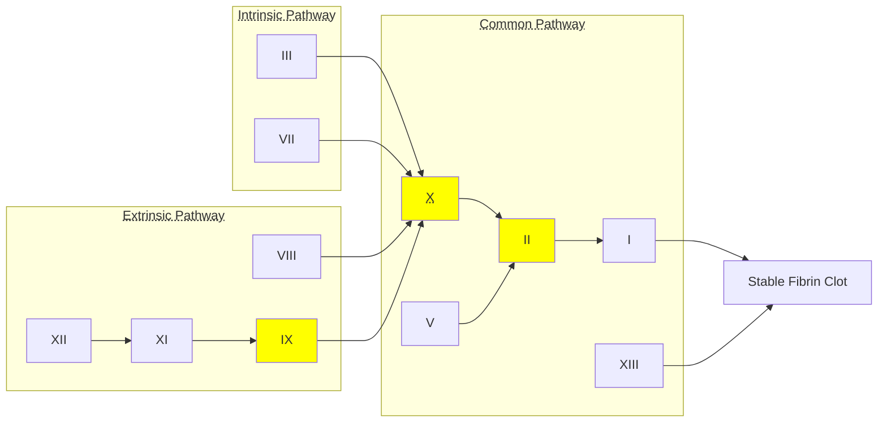

Lecture Notes

**Lecture Coverage:**
- Thrombosis
- Antiplatelets
- Anticoagulants
- Thrombolytic

---
#### **Thrombosis**
- Abnormal Activation of Coagulation Cascade → Blood Clot Formation
	- ∵ Oxidized LDL Accumulation on vessel wall → Endothelial Injury

**Coagulation Cascade**
- 3 Pathways: Extrinsic, Intrinsic & Common
- Involves <abbr Title="Xa">activated</abbr> factors activating <abbr Title="X → Xa">another factor</abbr> until clot formation:

