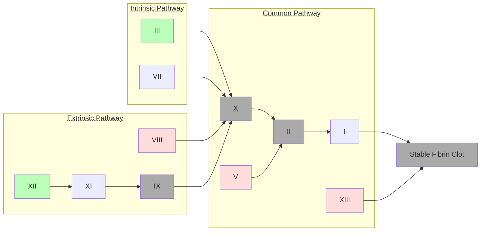

Lecture Notes

**Lecture Coverage:**
- Thrombosis
- Antiplatelets
- Anticoagulants
- Thrombolytic

---
#### **Thrombosis**
- Abnormal Activation of Coagulation Cascade → Blood Clot Formation
	- ∵ Oxidized LDL Accumulation on vessel wall → Endothelial Injury

**Coagulation Cascade**
- 3 Pathways: Extrinsic, Intrinsic & Common
- Involves <abbr Title="Xa">activated</abbr> factors activating <abbr Title="X → Xa">another factor</abbr> until clot formation:
	- Gray (2,9,10 & Blood Clot): Additionally requires Ca2+ to be activated
	- Red (5,8,13): Requires Factor IIa (Thrombin) to be activated
	- Green: Starting point of Each Pathway
		- 3: Requires 
	- Some Factors require additional molecules to be activated:

|   Color & Factors   | Note | Required Molecule |
| :-----------------: | ---- | ----------------- |
| 2,9,10 & Blood Clot |      |                   |
|         5,          |      |                   |
|                     |      |                   |

