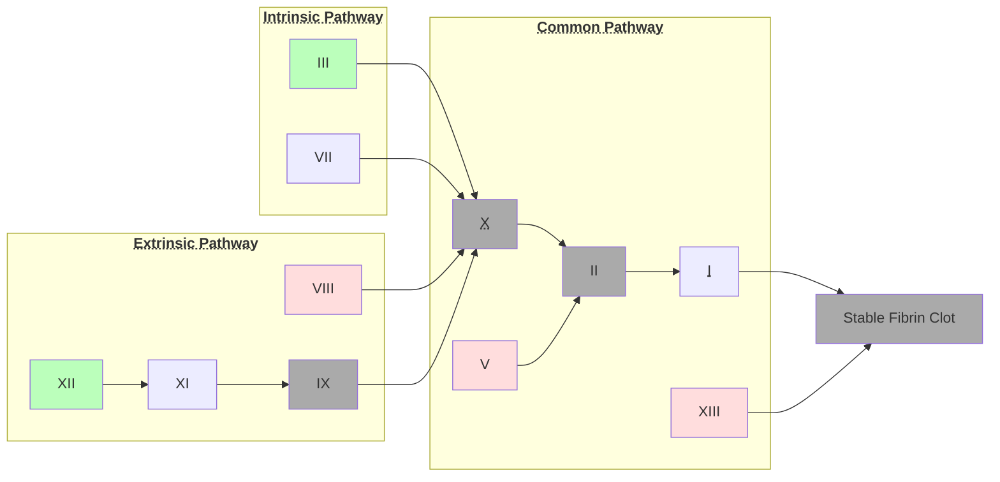

Lecture Notes

**Lecture Coverage:**
- Thrombosis
- Antiplatelets
- Anticoagulants
- Thrombolytic

---
#### **Thrombosis**
- Abnormal Activation of Coagulation Cascade → Blood Clot Formation
	- ∵ Oxidized LDL Accumulation on vessel wall → Endothelial Injury
- Clots mainly consist of Fibrin & Platelets
	- Platelet Coagulation happens through Platelet Adhesion
		- Regulated by Prostanoids
	- Fibrin Coagulation happens through Coagulation Cascade

**Platelet Coagulation**
- Stages in Platelet Coagulation:

| Step | Stage               | Description                                                                                                                                                                                                        |
| :--: | ------------------- | ------------------------------------------------------------------------------------------------------------------------------------------------------------------------------------------------------------------ |
|  1   | Platelet Activation | Platelet P2Y12 Receptors activated by <abbr Title="Released by Damaged Cells">ADP</abbr> → ↓ <abbr Title="Platelet Activation Inhibitor">cAMP</abbr> & ↑ Ca2+ |
|  2   | Fibrinogen Binding  | By <abbr Title="Glycoprotein">GP</abbr>IIb-IIIa → Platelet Aggregation                                                                                                              |
- Prostanoids in Platelet Regulation
	- Regulated by 2 Enzymes:
		- <abbr Title="Cyclooxygenase">COX</abbr>-1/2: Prostanoid Synthesis
		- <abbr Title="Phospholipase A2">PLA2</abbr>: Liberate Arachidonic Acid from Phospholipid as Prostanoid Synthesis Material
	- 2 Main Types of Prostanoids:

|                      Prostanoid                       |           Function            | Site of Production |
| :---------------------------------------------------: | :---------------------------: | :----------------: |
|  <abbr Title="Thromboxane A2">TXA2</abbr>  | Promotes Platelet Activation  |      Platelet      |
| <abbr Title="Prostaglandin I2">PGI2</abbr> | Inhibits Platelet Aggregation |    Endothelium     |

**Fibrin Coagulation through Coagulation Cascade**
- 3 Pathways: Extrinsic, Intrinsic & Common
- Involves <abbr Title="Xa">activated</abbr> factors activating <abbr Title="X → Xa">another factor</abbr> until clot formation:
	- Some Factors require additional molecules / condition to be activated:

|                                      Color & Factors                                       | Additional Condition                                                  |
| :----------------------------------------------------------------------------------------: | --------------------------------------------------------------------- |
|                                   II, IX, X & Blood Clot                                   | Ca2+                                                       |
|                           V, VIII, XIII                           | IIa (Thrombin)                                                        |
| III</abbr> (Start of Intrinsic Pathway) | Endothelium Damage                                                    |
| XII</abbr> (Start of Extrinsic Pathway) | Collagen / <abbr Title="Heavy Molecular Weight Kininogen">HMWK</abbr> |

#### **Antiplatelets**
**Antiplatelets Inhibiting Platelet Coagulation**
- Ticagrelor (P2Y12 Receptor Antagonist)
	- Selective & Reversible
	- ↓ Stroke & Heart Attack Risk in:
		- Coronary Heart Disease Patients
		- Patients already having mild stroke
	- Side Effect: Serious Bleeding

- Eptifibatide (GPIIb-IIIa Inhibitor)
	- <abbr Title="Arginine-Glycine-Aspartate">RGD</abbr> Sequence blocks Fibrinogen from binding to GPIIb-IIIa
	- Reversible
	- Used together with Aspirin / Heparin

**Antiplatelets Inhibiting Prostanoid Formation**
- Aspirin (COX Inhibitor)
	- ↓ TXA2 Formation → ↓ Platelet Activation
	- Irreversible
	- Side Effect:
		- GI Bleeding
		- Hemorrhagic Stroke

#### **Anticoagulants**
**Antithrombin III Activators (Heparin)**
- Contains 2 Segments ([Video](https://www.youtube.com/watch?v=_2B40juput0))
	- Pentasaccharide Sequence: Changes Antithrombin III conformation for it to bind strongly to Factor Xa
	- Heparin: Longer chain binds more strongly to Thrombin → ↓ Xa-Selectivity
		- Unfractionated Heparin (~40S): Strong Xa & Thrombin Inhibition
		- <abbr Title="Low Molecular Weight Heparin">LMWH</abbr> (13S): Strong Xa Inhibition only
			- e.g. Enoxaparin

**Direct Thrombin Inhibitors (Dabigatran)**
- Binds to Thrombin Active Site
	- Reversible
	- Can Inhibit even when Thrombin is Fibrin-bound → Fibrinolysis

**Clotting Factor Synthesis Inhibitor (Warfarin)**
- Vitamin K Epoxide Reductase Inhibitor
	- ↓ Reduced Vitamin K → Carboxylation of <abbr Title="II, IX, X">Clotting Factors for Ca2+ Binding</abbr> → Halt Coagulation Cascade
- Orally Active
- Delayed Onset
	- ∵ Time needed to deplete existing reduced Vitamin K
- Side Effects: Toxicity & <abbr Title="Defective Fetus">Teratogenicity</abbr>
	- Antidote: More Vitamin K

#### **Thrombolytics**
**Fibrinolytic System**

| Step |             Stage             |                                                       Activators                                                        |                      Inhibitors                       |
| :--: | :---------------------------: | :---------------------------------------------------------------------------------------------------------------------: | :---------------------------------------------------: |
|  1   |     Plasminogen → Plasmin     | <abbr title="Tissue-Plasminogen Activator">t-PA</abbr> & <abbr title="Urokinase-Type Plasminogen Activator">u-PA</abbr> | <abbr Title="Plasminogen Activator Inhibitor-1">PAI-1 |
|  2   | Fibrin Degradation by Plasmin |                                                                                                                         |       <abbr Title="α2-Antiplasmin">α2-AP</abbr>       |

**Thrombolytic Drugs**
- Streptokinase
	- Plasminogen Activator
		- Both Fibrin-bound & Circulating Plasminogen
	- Side Effect: 
		- Circulating Clot Dissolution → Bleeding
		- Bacterial Origin → Antigenic
- Tenecteplase
	- Plasminogen Activator
		- ↑ Specificity on Fibrin-bound
	- Side Effect:
		- Less Circulating Clot Dissolution → Mild Bleeding