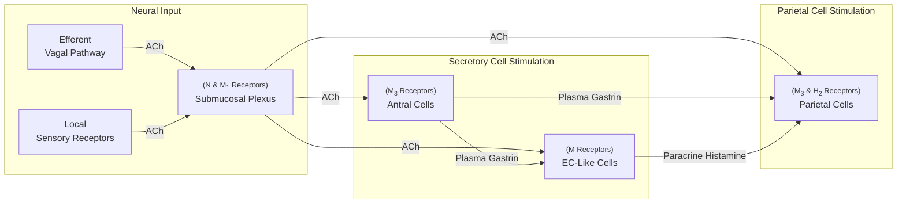

Lecture Notes

**Lecture Coverage:**
- Gastric Ulcer
- Drugs for Gastric Ulcer

---
#### **Gastric Ulcer**
**Causes of Gastric Ulcer**
- Direct: 
	- Inability of mucus to protect gastric mucosa
- Indirect:
	- H. Pylori Infection
	- Anti-inflammatory Drugs (COX-1 inhibitors)

**Stimulation of Acid Secretion**

