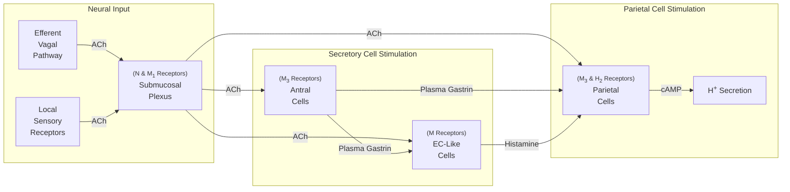

Lecture Notes

**Lecture Coverage:**
- Gastric Ulcer
- Antacids
- Mucosa Protecting Drugs
- Triple Therapy

---
#### **Gastric Ulcer**
**Causes of Gastric Ulcer**
- Direct: 
	- Inability of mucus to protect gastric mucosa
- Indirect:
	- H. Pylori Infection
	- NSAIDs (COX-1 inhibitors)

**Stimulation of Acid Secretion**

**Inhibition of Acid Secretion**
- PG Synthesis by COX-1
	- ↓ Parietal Cell H+ Pump
	- ↑ Mucous Cell Secretion of Mucus & Bicarbonate
- Somatostatin Secretion
	- ↓ Parietal Cell H+ Pump

#### **Antacids**
- Aim: ↓ Acid Secretion

**Muscarinic M₁ Antagonists**
- [[Lecture 5.1 - (Synaptic Pharmacology) Cholinergic Receptors#**Muscarinic Cholinergic Receptor Drugs**|Atropine-Like Drugs]] (e.g. Pirenzepine)
- Selective Inhibition of ACh Release from Submucosal Plexus
	- Anti-Spasmodic → Analgesic
	- Low CNS Penetration

**Histamine H₂ Antagonists**
- Suffix: -tidine (e.g. Cimetidine, Ranitidine, Famotidine)
- Competitive Inhibition of Histamine Release from EC-Like Cells
	- Heals Ulcers due to Food / Gastrin
	- Treats Gastro-oesophageal Reflux

**Proton Pump Inhibitors**
- Suffix: -zole (e.g. Omeprazole)
- Irreversible Inhibition on H+/K+-ATPase as Sulphenamide
	- Absorbed in Duodenum
	- Accumulates in Parietal Cell Canaliculi

#### **Mucosa Protecting Drugs**
