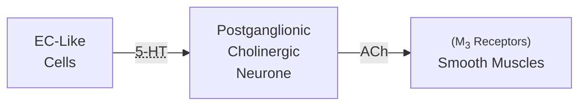

Lecture Notes

**Lecture Coverage:**
- Peristaltic Reflex
- idk

---
#### **Peristaltic Reflex**
- Contraction & Relaxation of Circular & Longitudinal Muscles
	- Contraction of orally-proximal muscles
	- Relaxation of anally-proximal muscles

**Stimulation of Contraction**

**Inhibition of Contraction**
