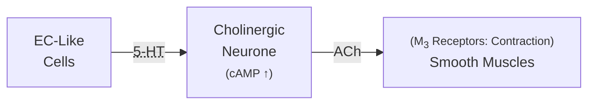
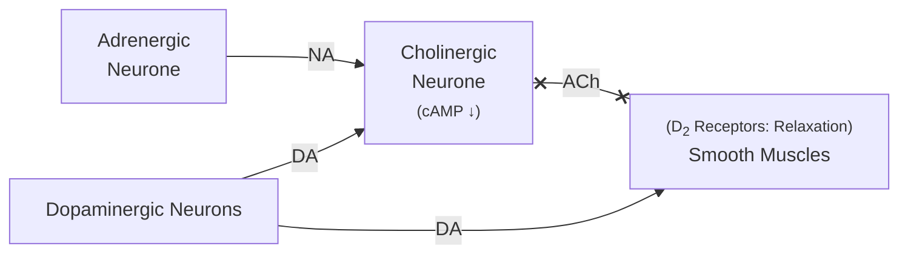

Lecture Notes

**Lecture Coverage:**
- Peristaltic Reflex
- GERD Drugs
- Constipation Drugs
- Diarrhea Drugs

---
#### **Peristaltic Reflex**
- Contraction & Relaxation of Circular & Longitudinal Muscles
	- Contraction of orally-proximal muscles
	- Relaxation of anally-proximal muscles

**Stimulation of Contraction**
- Initiated by Lumen Pressure from Bolus

**Inhibition of Contraction**

#### **GERD Drugs**
**Gastro-Esophageal Reflux DiGERD**
