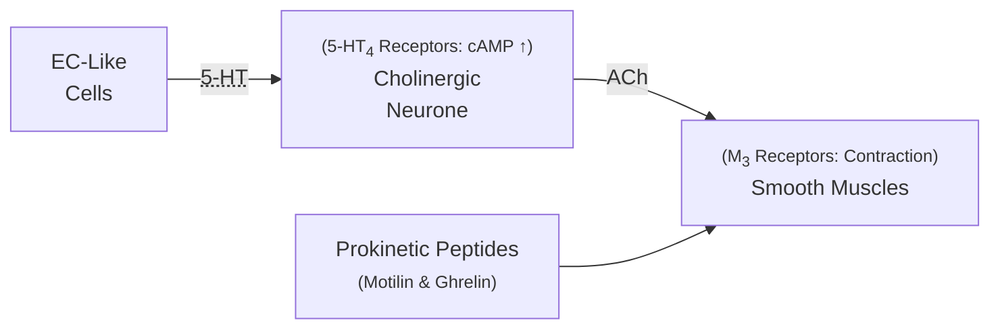
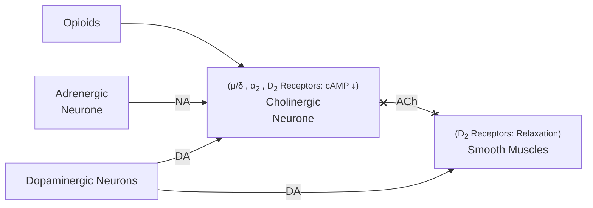

Lecture Notes

**Lecture Coverage:**
- Peristaltic Reflex
- GERD Drugs
- Constipation Drugs
- Diarrhea Drugs

---
#### **Peristaltic Reflex**
- Contraction & Relaxation of Circular & Longitudinal Muscles
	- Contraction of Orally-proximal muscles
	- Relaxation of Anally-proximal muscles

**Stimulation of Motility**
- Initiated by Lumen Pressure from Bolus

**Inhibition of Motility**

#### **GERD Drugs**
**Gastro-Esophageal Reflux Disorder (GERD)**
- Damage & Inflammation → Peristalsis Disorder & Relaxed Sphincter
-  Drug Aim: ↑ Oesophageal Peristalsis & ↓ Peptic Ulcer

**Peptic Ulcer Drugs**
- [[Lecture 9.1 - (Gastrointestinal Pharmacology) Gastric Ulcer Drugs#**Antacids**|Antacids]]
- [[Lecture 9.1 - (Gastrointestinal Pharmacology) Gastric Ulcer Drugs#**Mucosa Protecting Drugs**|Mucosa Protecting Drugs]]

**Motility Stimulating Drugs**
- 5-HT4 Receptor Agonists → ↑ Motility
	- Suffix: -pride (e.g. Cisapride, Mosapride, Prucalopride)
- [[Lecture 5.1 - (Synaptic Pharmacology) Cholinergic Receptors|M₃ Receptor Agonists]] → ↑ Motility
	- Bethanechol
- D2 Receptor Antagonists → ↓ Inhibition on Motility
	- Domperidone: Low CNS Penetration
	- Metoclopramide: Also a 5-HT4 Receptor Agonist

**Prokinetic Peptide Agonists**
- Motilin Agonists
	- Erythromycin: Also an Antibiotic
	- GSK962040
- Ghrelin Agonists
	- Suffix: -morelin (e.g. Ipamorelin, Anamorelin)

#### **Constipation Drugs**
**Constipation**
- ↓ Peristalsis & Lubrication → ↓ Bowel Movement
	- Can be caused by Drugs
- Drug Aim: ↑ Bolus size (Water Absorption) → ↑ Peristalsis Stimulation → Laxation

**Laxatives**

|          Type          | Name                     | Note                                                                       | Onset    |
| :--------------------: | ------------------------ | -------------------------------------------------------------------------- | -------- |
|     Bulk Laxative      | Methylcellulose          | Causes <abbr Title="Farting">Flatulence</abbr> 60-100x Water Absorption | 1-3d     |
|    Osmotic Laxative    | Lactulose Mannitol    | Poorly absorbed salts & sugar Good Water Absorption                     | 1-3h     |
|   Irritant Laxative    | Bisacodyl Sennatoside | Stimulates Myenteric Plexus - ↑ Cholinergic Neuron cAMP → ↑ Motility    | 6-8h     |
|  Lubricant Laxative | Docusate                 | Draws water into Fecal Mass                                                |  1-3d |
|           ^            | Liquid Paraffin          | ↓ Vitamin Absorption                                                       | ^        |

#### **Diarrhea Drugs**
**Diarrhea**
- ↑ Peristalsis & Secretion → ↓ Absorption & ↑ Water loss
	- Can be caused by Drugs, Virus & Bacteria
- Non-Drug Treatment Aim: Replace Loss Fluid
- Drug Aim: Eliminate Toxin & ↓ Peristalsis
	- Only use when Symptoms are Chronic / not Severe
	- May lead to Fatal GI Obstruction & Coma when:
		- Severe symptoms (Fever / Incapacitation)
		- Children / Pregnant Women

**Toxin-Eliminating Agents**
- Kaolin, Dioctahedral Smectite & Charcoal
	- Toxin-absorbing Surface

- Bismuth Salicylate & Subsalicylate
	- Antibacterial
	- Also COX Inhibitors

**Peristalsis Inhibiting Agents**
- Opioid Receptor Agonists
	- Codeine
	- Loperamide & Diphenoxylate: ↓ CNS Penetration → ↓ Side Effects