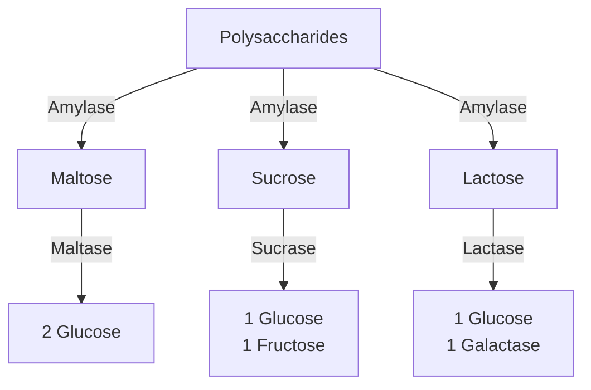
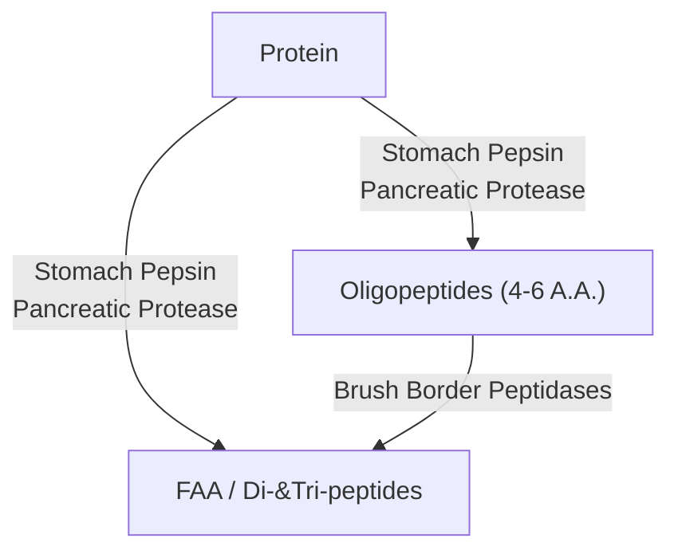

Lecture Notes

**Lecture Coverage:**
- Digestion & Absorption of Carbohydrates
- Digestion & Absorption of Proteins
- Absorption of Lipids

---
#### **Digestion & Absorption of Carbohydrates**
**Digestion of Carbohydrates**
- Polysaccharides → Disaccharides → <abbr Title="Glucose, Galactose, Fructose">Monosaccharides</abbr> (Absorbable form)

**Absorption of Carbohydrates**
- Movement from Lumen → Enterocyte → Capillaries
	- Through Enterocyte Transporter Proteins
	- Fructose has different Pathway from Glucose & Galactose

|         Movement         |                        Glucose & Galactose Transporter                         |                           Fructose Transporter                            |
| :----------------------: | :----------------------------------------------------------------------------: | :-----------------------------------------------------------------------: |
|    Lumen → Enterocyte    | <abbr Title="Sodium GLucose co-Transporter 1">SGLT-1</abbr> (Active Transport) | <abbr Title="GLUcose Transporter 5">GLUT-5</abbr> (Facilitated Diffusion) |
| Enterocyte → Capillaries |   <abbr Title="GLUcose Transporter 2">GLUT-2</abbr> (Facilitated Diffusion)    |                                     <                                     |

#### **Digestion & Absorption of Proteins**
**Digestion of Proteins**
- Proteins → Oligopeptides (Poorly Absorbed) → <abbr Title="Free Amino Acid">FAA</abbr> / Di-&Tri-peptides (Absorbable Form)
	- Types of FAAs: Acidic, Basic, Neutral, Imino

**Absorption of Proteins**
- Movement from Lumen → Enterocyte → Capillaries
	- FAA has different Pathway from Di-&Tri-peptides

|         Movement         |                FAA                | Di-&Tri-Peptides |
| :----------------------: | :-------------------------------: | :--------------: |
|    Lumen → Enterocyte    | Sodium-Amino Acid Co-Transporters |                  |
| Enterocyte → Capillaries |                                   |                  |