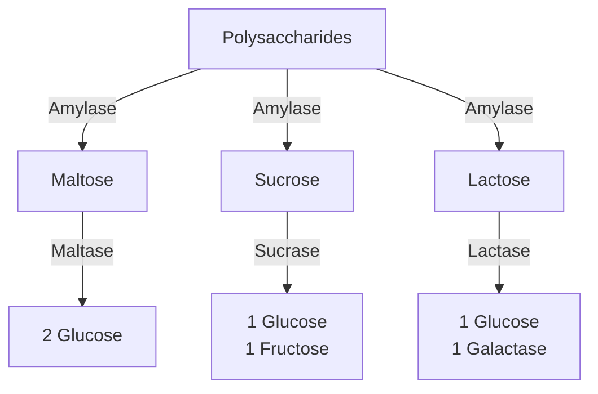
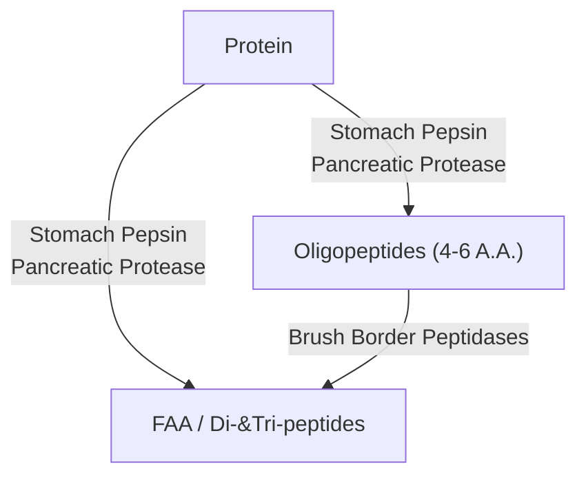

Lecture Notes

**Lecture Coverage:**
- Digestion & Absorption of Carbohydrates
- Digestion & Absorption of Proteins
- Digestion & Absorption of Lipids

---
#### **Digestion & Absorption of Carbohydrates**
**Digestion of Carbohydrates**
- Polysaccharides → Disaccharides → <abbr Title="Glucose, Galactose, Fructose">Monosaccharides</abbr> (Absorbable form)

**Absorption of Carbohydrates**
- Movement from Lumen → Enterocyte → Capillaries
	- Through Enterocyte Transporter Proteins
	- Fructose has different Pathway from Glucose & Galactose

|         Movement         |                        Glucose & Galactose Transporter                         |                           Fructose Transporter                            |
| :----------------------: | :----------------------------------------------------------------------------: | :-----------------------------------------------------------------------: |
|    Lumen → Enterocyte    | <abbr Title="Sodium GLucose co-Transporter 1">SGLT-1</abbr> (Active Transport) | <abbr Title="GLUcose Transporter 5">GLUT-5</abbr> (Facilitated Diffusion) |
| Enterocyte → Capillaries |   <abbr Title="GLUcose Transporter 2">GLUT-2</abbr> (Facilitated Diffusion)    |                                     <                                     |

#### **Digestion & Absorption of Proteins**
**Digestion of Proteins**
- Proteins → Oligopeptides (Poorly Absorbed) → <abbr Title="Free Amino Acid">FAA</abbr> / Di-&Tri-peptides (Absorbable Form)

**Absorption of Proteins**
- Movement from Lumen → Enterocyte → Capillaries
	- FAA has different Pathway from Di-&Tri-peptides
	- Different Mechanisms for Different A.A. Types (Acidic, Basic, Neutral, Imino)

|         Movement         |                                                                 FAA                                                                 |                         Di-&Tri-Peptides                          |
| :----------------------: | :---------------------------------------------------------------------------------------------------------------------------------: | :---------------------------------------------------------------: |
|    Lumen → Enterocyte    | <abbr Title="One for each A.A. Type (Acidic, Basic, Neutral, Imino)">Sodium-Amino Acid Co-Transporters</abbr> (Active Transport) | Separate Hydrogen-Dependent Co-Transporters (Active Transport) |
|        Enterocyte        |                                                                  /                                                                  |            Hydrolysis to FAA by Cytoplasmic Peptidases            |
| Enterocyte → Capillaries |                                            Different Mechanisms for Each Amino Acid Type                                            |                                 <                                 |

#### **Digestion & Absorption of Lipids**
**Digestion of Lipids**
- Lipid Droplet Mechanical Breakdown (Churning & Mixing) → Emulsification → Lipid in Micelle (Absorbable Form)

**Absorption of Lipids**

| **Step** | **Event**              | **Description**                                                                                                                                                |
| -------- | ---------------------- | -------------------------------------------------------------------------------------------------------------------------------------------------------------- |
| 1        | Diffusion              | Lipid Diffuse into <abbr Title="Brush Border Membrane">BBM</abbr> from Micelles                                                                                |
|  2    |  Re-esterification  | Monoglyceride + <abbr Title="Long Chain Fatty Acid">LCFA</abbr> → Triglyceride Cholesterol + LCFA → Cholesterol Ester Lysolecithin + LCFA → Phospholipid |
| 3        | Chylomicron Formation  | Lipids are packaged with apoprotein                                                                                                                            |
| 4        | Chylomicron Exocytosis | Chylomicron cross the <abbr Title="Basolateral Membrane">BLM</abbr> into Lacteal                                                                               |

#### **Digestion & Absorption of Water & Electrolytes**
- 2L Dietary fluid & 7L Secreted Fluid
	- ~80%: From Small Intestine enterocytes (Solute absorption before water)
	- ~1.5L: From Large Intestine

#### **Absorption of Vitamins**
Fat Soluble Vitamins (ADEK)
- Solubilized in micelles & travel to lacteal in chylomicrons

Water Soluble Vitamins (BC except B12)
- Small Intestine: Na+-Dependent Cotransporter

Vitamins B12
- Distal Ileum Only: Requires Intrinsic Factor
