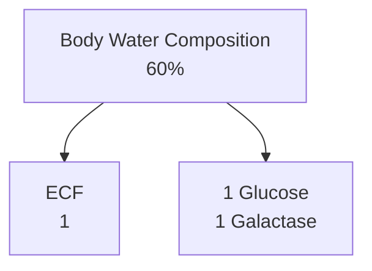

Lecture Notes

**Lecture Coverage:**
- Distribution of Water & Solutes

---
#### **Distribution of Water & Solutes**

```mermaid  
graph TD;
	A["Body Water Composition
	60%"]
	A --> B["ECF
	1"];
	A --> C["1 Glucose
	1 Galactase"];
```