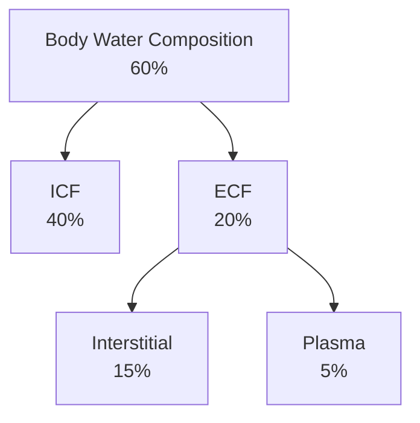

Lecture Notes

**Lecture Coverage:**
- Distribution of Water & Solutes
- Regulation of Body Osmolality

---
#### **Distribution of Water & Solutes**
**Distribution of Water**

**Distribution of Ions**

| Compartment | Major Cations  | Major Anions                                |
| ----------- | -------------- | ------------------------------------------- |
| ECF         | Na+ | Cl-, HCO3- |
| ICF         | K+  | Pi , Organic Anions & Proteins   |
- ECF:ICF Ratio regulation mainly contributed by Na+ osmotic activity

**Measurement of Particles in Water**
- Number of Particles in Solution: Osmol / mOsmol
	- Non-ionizing substances: 1 mmol = 1 mOsmol
	- Ionizing substances: 1 mmol = 2 mOsmol
- Concentration of Particles in a Solution: Osmolarity & Osmolality
	- Osmolality: Particle Concentration in 1 kg water (mOsmol/kg H2O)
	- Osmolarity: Particle Concentration in 1 L water (mOsmol/L H2O)

#### **Regulation of Body Osmolality**
**Countercurrent Multiplier System**
- Control of nephron osmolality by Na+-K+-2Cl- cotransporter from Ascending Limb to Interstitial Compartment
	- Ascending Limb
