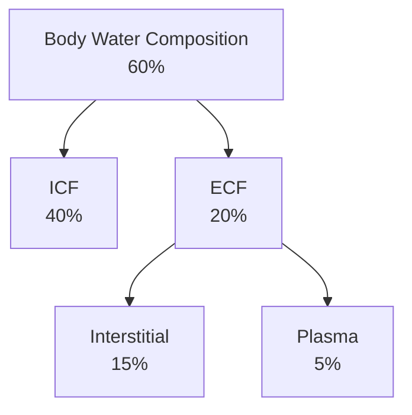

Lecture Notes

**Lecture Coverage:**
- Distribution of Water & Solutes
- Water Reabsorption in Loop of Henle
- Regulation of Water Balance

---
#### **Distribution of Water & Solutes**
**Distribution of Water**

**Distribution of Ions**

| Compartment | Major Cations  | Major Anions                                |
| ----------- | -------------- | ------------------------------------------- |
| ECF         | Na+ | Cl-, HCO3- |
| ICF         | K+  | Pi , Organic Anions & Proteins   |
- ECF:ICF Ratio regulation mainly contributed by Na+ osmotic activity

**Measurement of Particles in Water**
- Number of Particles in Solution: Osmol / mOsmol
	- Non-ionizing substances: 1 mmol = 1 mOsmol
	- Ionizing substances: 1 mmol = 2 mOsmol
- Concentration of Particles in a Solution: Osmolarity & Osmolality
	- Osmolality: Particle Concentration in 1 kg water (mOsmol/kg H2O)
	- Osmolarity: Particle Concentration in 1 L water (mOsmol/L H2O)

#### **Water Reabsorption in Loop of Henle**
**Countercurrent Multiplier System ([Video](https://www.youtube.com/watch?v=uYu-zvCXiV4))**
- Control of Medullary Interstitium Osmolality so that it increases along from cortex to the deep medulla for water reabsorption
	- Descending Limb (Aquaporin I): Net water flow from Descending Limb to Medullary Interstitium
		- Osmolality keeps increasing until 1200 mOsmol at turning point (Hypertonic)
	- Ascending Limb (Na+-K+-2Cl- cotransporter): Net solute flow from Ascending Limb to Medullary Interstitium
		- Until always 200 mOsmol lower than Medullary Interstitium at same depth (Hypotonic)

**Vasa Recta as Countercurrent Exchanger**
- Capillaries lining along Loop of Henle
- Interstitium Osmolality increases along with Descending Vessel
	- → Vessel water efflux & NaCl influx to Interstitium
- Interstitium Osmolality decreases along with Ascending Vessel
	- → Vessel NaCl efflux & water influx to Interstitium after equilibrium
- Purpose: Prevents rapid removal of NaCl from Interstitium
	- → Maintain Osmotic Gradient in the Interstitium

**Urea Recycling**
- Urea are absorbed from <abbr Title="Inner Medullary Collecting Duct">IMCD</abbr> through the Interstitium to <abbr Title="Thin Descending Limb of Loop of Henle">tDLH</abbr> then transported through the loop of Henle to IMCD again
	- → Contributes to high medulla osmolality

#### **Regulation of Water Balance**
**Water Reabsorption by ADH**

| Stage             | Description                                                                                                           |
| ----------------- | --------------------------------------------------------------------------------------------------------------------- |
| Production        | In Hypothalamus (Paraventricular / Supraoptic Nuclei)                                                                 |
| Stimulation       | By ↑ Plasma Osmolality (Osmoreceptors) By ↓ Blood Volume / Pressure (Baroreceptors in Aortic Arch & Carotid Sinus) |
| Storage & Release | In Posterior Pituitary                                                                                                |
| Action            | Inducing AQP2 Insertion in Apical Membrane of Collecting Duct Principal Cells                                         |
| Effect            | ↑ Water reabsorption → Concentrated Urine                                                                             |

****