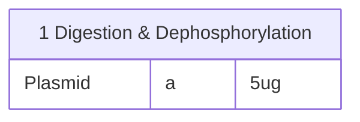

**Subtopics:**
- CRISPR/Cas9 Mechanism

---
#### **CRISPR/Cas9 Mechanism**
**Steps of Cas9 Gene Editing**

|    Step     | Event                                                                                                                                                                                                                                                                                                                    |
| :---------: | ------------------------------------------------------------------------------------------------------------------------------------------------------------------------------------------------------------------------------------------------------------------------------------------------------------------------ |
| Recognition | <abbr Title="Nuclease">Cas9</abbr> searches for <abbr Title="2-3 b.p. Protospacer-Adjacent Motifs (e.g. NGG)">PAM</abbr> sequence → Scans if adjacent <abbr Title="20 b.p. sequence upstream of PAM">protospacer</abbr> matches gRNA spacer sequence                                                                  |
|  Cleavage   | If match, Cas9 causes <abbr Title="Double Strand Break">DSB</abbr> <abbr Title="Typically 3-4 b.p. upstream of PAM">within the protospacer</abbr>                                                                                                                                                                        |
|  Insertion  | Host cell <abbr Title="Homology-Directed Repair">HDR</abbr> integrates <abbr Title="Foreign gene to be inserted + Homology arms">Donor Template</abbr> into the cut for repair → <abbr Title="This shi too complicated :wilt_rose: see if need to learn later">Replaces the Original Sequence due to Resection</abbr> |

**HDR and Donor Template Design**
- HDR only insert oligo with homology arms into the cut site
	- Donor template needs to have <abbr Title="Left Homology Arm">LHA</abbr> & <abbr Title="Right Homology Arm">RHA</abbr>
		- LHA needs to be homologous to original sequence left of the cut
		- RHA needs to be homologous to original sequence right of the cut
- Needs to prevent future Cas9 recognition
	- → Alterations to Protospacer & PAM in RHA
- Final Donor Template Design:

